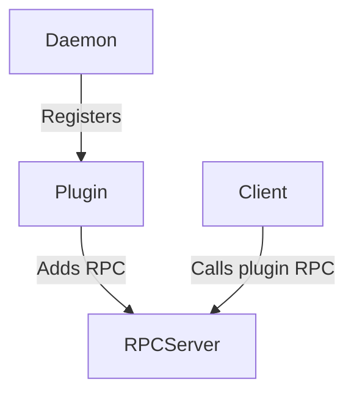
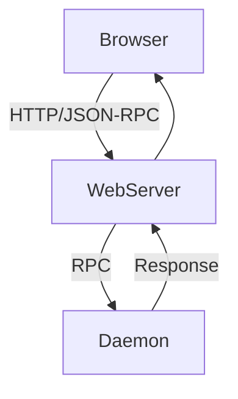

# Key Flows and Diagrams

Below are simplified Mermaid diagrams illustrating critical flows in Deluge.

## Torrent Add Flow
```mermaid
graph TD
    UI[User Interface] -->|RPC "core.add_torrent"| Daemon
    Daemon -->|Checks plugins| Plugins
    Daemon -->|Starts download| libtorrent
```

## Plugin Interaction


## Web UI Request Cycle

